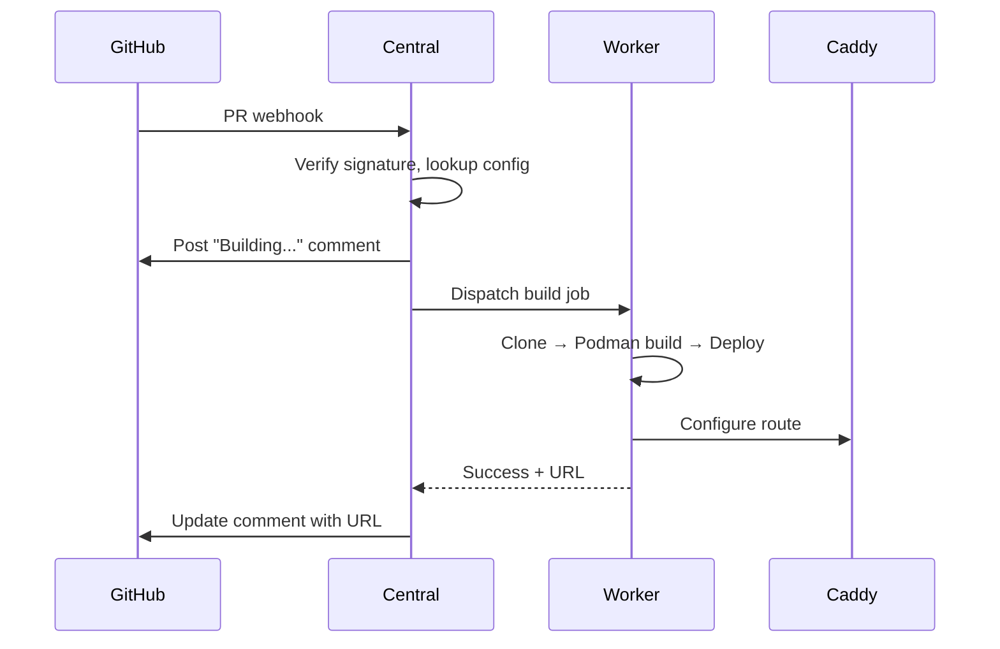
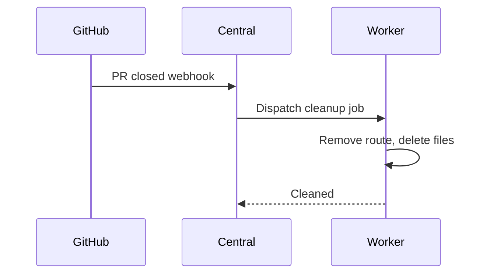
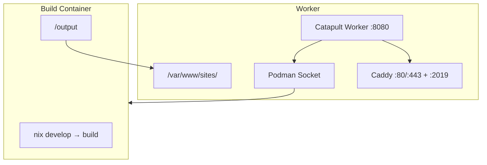

# Architecture

## Overview

Catapult has two components:

1. **Central** (`catapult.example.com`) - GitHub webhook receiver and job orchestrator
2. **Worker** (`deployer.<zone>`) - Build executor inside Caddy containers

```
┌─────────────────────────────────────────────────────────────────────┐
│                          GitHub                                      │
│  ┌──────────┐  ┌──────────┐  ┌──────────┐                          │
│  │ Repo A   │  │ Repo B   │  │ Repo C   │                          │
│  └────┬─────┘  └────┬─────┘  └────┬─────┘                          │
│       └─────────────┼─────────────┘                                  │
│                     │ Webhook (PR/Push)                              │
└─────────────────────┼────────────────────────────────────────────────┘
                      ▼
┌─────────────────────────────────────────────────────────────────────┐
│              Catapult Central (catapult.example.com)                 │
│  ┌──────────────────────────────────────────────────────────────┐   │
│  │  POST /webhook/github → verify → dispatch to worker          │   │
│  └──────────────────────────────────────────────────────────────┘   │
│  ┌──────────────────────────────────────────────────────────────┐   │
│  │  PostgreSQL: deployment_config, workers, deployment_history  │   │
│  └──────────────────────────────────────────────────────────────┘   │
└─────────────────────────────────────────────────────────────────────┘
                              │ HTTPS + HMAC
                              ▼
┌─────────────────────────────────────────────────────────────────────┐
│              Catapult Worker (deployer.<zone>)                       │
│  ┌──────────────────────────────────────────────────────────────┐   │
│  │  POST /build  → clone → podman build → deploy → callback     │   │
│  │  POST /cleanup → remove route → delete files                 │   │
│  └──────────────────────────────────────────────────────────────┘   │
│  ┌──────────────────────────────────────────────────────────────┐   │
│  │  Caddy: dynamic routes via admin API (:2019)                 │   │
│  └──────────────────────────────────────────────────────────────┘   │
└─────────────────────────────────────────────────────────────────────┘
```

## Event Flows

### PR Opened/Synchronized



### PR Closed



## Database Schema

### deployment_config

| Column | Type | Description |
|--------|------|-------------|
| `github_org` | VARCHAR | GitHub organization/user |
| `github_repo` | VARCHAR | Repository name |
| `environment` | VARCHAR | Zone/tenant identifier |
| `domain` | VARCHAR | Base domain |
| `subdomain` | VARCHAR | Subdomain for main branch |
| `site_type` | VARCHAR | Build type (sveltekit, vite, zola, auto) |

### workers

| Column | Type | Description |
|--------|------|-------------|
| `environment` | VARCHAR | Zone this worker serves |
| `endpoint` | VARCHAR | Worker URL (e.g., https://deployer.example.com) |
| `enabled` | BOOLEAN | Active flag |

## API Endpoints

### Central

**`POST /webhook/github`** - Receives GitHub webhooks
Headers: `X-Hub-Signature-256`, `X-GitHub-Event`

**`POST /api/status`** - Receives worker status callbacks
Headers: `X-Worker-Signature`

### Worker

**`POST /build`** - Triggers build job
**`POST /cleanup`** - Removes PR deployment

All requests are HMAC-signed with timestamps for replay protection.

## Build Container



Build containers are isolated:
- Network blocks RFC1918, localhost
- Read-only root, tmpfs for /tmp
- Memory/CPU/PID limits
- All capabilities dropped

## Security

- **Webhook verification**: HMAC-SHA256 with constant-time comparison
- **Central ↔ Worker auth**: HMAC-signed requests with 5-minute replay window
- **GitHub tokens**: Generated via App JWT, 1-hour expiry, never persisted
- **Build isolation**: Podman containers with network restrictions
