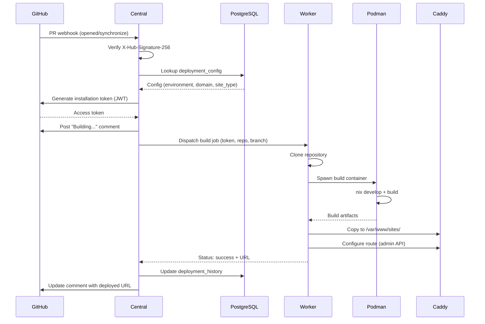
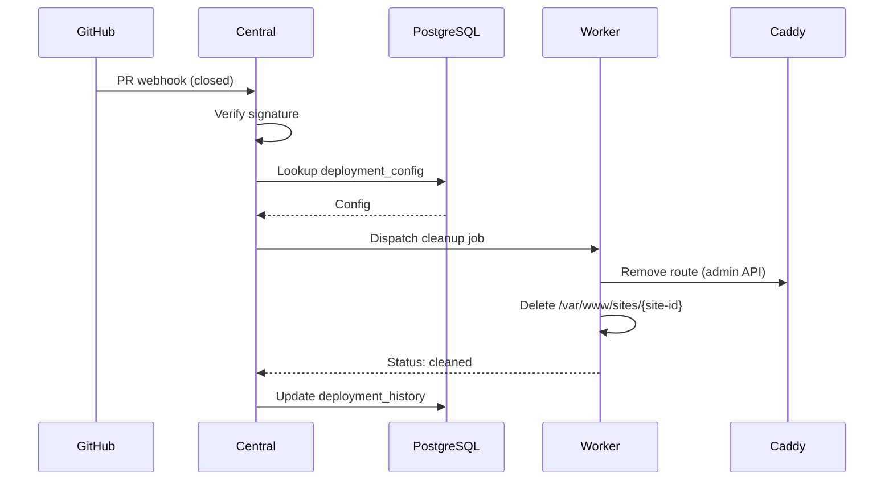
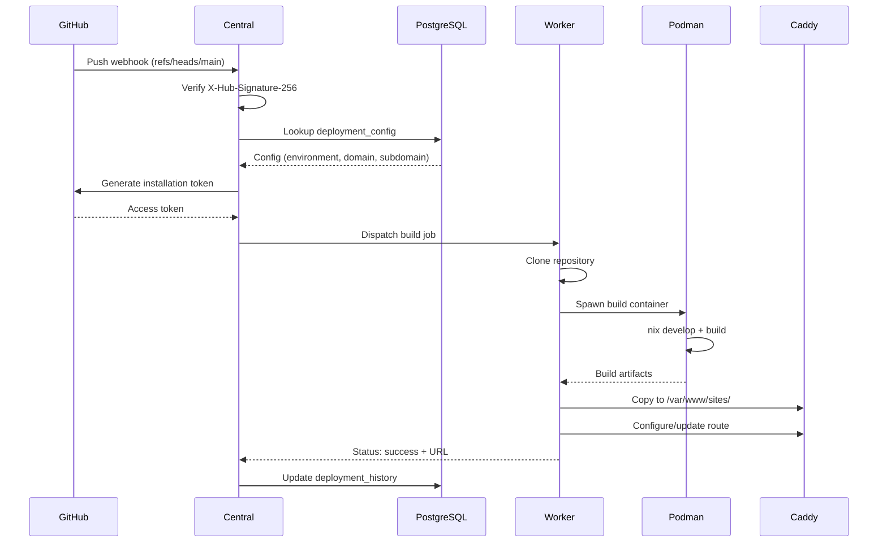
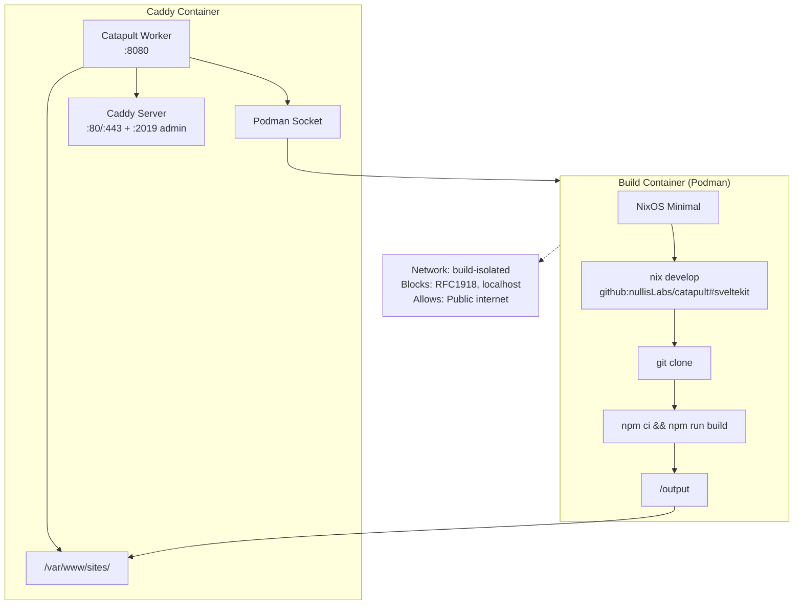

# Architecture

## System Overview

Catapult is a deployment automation system with two components:

1. **Central** (`catapult.nullislabs.io`) - GitHub webhook receiver and orchestrator
2. **Worker** (`deployer.<zone>`) - Build executor running inside Caddy containers

```
┌─────────────────────────────────────────────────────────────────────┐
│                          GitHub                                      │
│  ┌──────────┐  ┌──────────┐  ┌──────────┐                          │
│  │ Repo A   │  │ Repo B   │  │ Repo C   │                          │
│  └────┬─────┘  └────┬─────┘  └────┬─────┘                          │
│       │             │             │                                  │
│       └─────────────┼─────────────┘                                  │
│                     │ Webhook (PR/Push events)                       │
└─────────────────────┼────────────────────────────────────────────────┘
                      ▼
┌─────────────────────────────────────────────────────────────────────┐
│              Catapult Central (catapult.nullislabs.io)               │
│  ┌──────────────────────────────────────────────────────────────┐   │
│  │                    HTTP Server (Axum)                         │   │
│  │  POST /webhook/github                                         │   │
│  └──────────────────────────────────────────────────────────────┘   │
│                              │                                       │
│  ┌───────────────────────────┴──────────────────────────────────┐   │
│  │  1. Verify X-Hub-Signature-256                                │   │
│  │  2. Parse event (PR opened/synced/closed, push to main)       │   │
│  │  3. Query deployment_config for org/repo                      │   │
│  │  4. Generate installation access token (JWT → OAuth)          │   │
│  │  5. Post "Building..." comment to PR                          │   │
│  │  6. Dispatch job to worker (based on environment)             │   │
│  └───────────────────────────────────────────────────────────────┘   │
│                              │                                       │
│  ┌───────────────────────────┴──────────────────────────────────┐   │
│  │                    PostgreSQL                                 │   │
│  │  • deployment_config (org/repo → environment mapping)         │   │
│  │  • deployment_history (build logs)                            │   │
│  │  • workers (registered worker endpoints)                      │   │
│  └───────────────────────────────────────────────────────────────┘   │
└─────────────────────────────────────────────────────────────────────┘
                              │
                              │ HTTPS + HMAC auth
                              ▼
┌─────────────────────────────────────────────────────────────────────┐
│              Catapult Worker (deployer.<zone>)                       │
│              Inside Caddy Container                                  │
│  ┌──────────────────────────────────────────────────────────────┐   │
│  │                    HTTP Server (Axum)                         │   │
│  │  POST /build                                                  │   │
│  │  POST /cleanup                                                │   │
│  └──────────────────────────────────────────────────────────────┘   │
│                              │                                       │
│  ┌───────────────────────────┴──────────────────────────────────┐   │
│  │  Build Pipeline:                                              │   │
│  │  1. Receive job (repo URL, token, branch, commit, config)     │   │
│  │  2. Clone repository (with installation token)                │   │
│  │  3. Spawn Podman container (NixOS + nix develop)              │   │
│  │  4. Execute build command                                     │   │
│  │  5. Copy artifacts to /var/www/sites/{site-id}/               │   │
│  │  6. Configure Caddy route via admin API                       │   │
│  │  7. Report status back to Central                             │   │
│  └───────────────────────────────────────────────────────────────┘   │
│                              │                                       │
│  ┌───────────────────────────┴──────────────────────────────────┐   │
│  │  Caddy Server (localhost:2019 admin API)                      │   │
│  │  • Dynamic route configuration                                │   │
│  │  • Serves static files from /var/www/sites/                   │   │
│  └───────────────────────────────────────────────────────────────┘   │
└─────────────────────────────────────────────────────────────────────┘
```

## Event Flows

### Pull Request Opened/Synchronized



### Pull Request Closed/Merged



### Push to Main Branch



## Database Schema

### deployment_config

Maps repositories to environments and workers.

| Column | Type | Description |
|--------|------|-------------|
| `id` | SERIAL | Primary key |
| `github_org` | VARCHAR(255) | GitHub organization/user |
| `github_repo` | VARCHAR(255) | Repository name |
| `environment` | VARCHAR(50) | Environment identifier (nullislabs, nullispl) |
| `domain` | VARCHAR(255) | Base domain for deployments |
| `subdomain` | VARCHAR(255) | Subdomain for main branch (nullable) |
| `site_type` | VARCHAR(50) | Build type (sveltekit, vite, zola, auto) |
| `enabled` | BOOLEAN | Active flag |
| `created_at` | TIMESTAMP | Creation time |
| `updated_at` | TIMESTAMP | Last update time |

### workers

Registered worker endpoints.

| Column | Type | Description |
|--------|------|-------------|
| `id` | SERIAL | Primary key |
| `environment` | VARCHAR(50) | Environment this worker serves |
| `endpoint` | VARCHAR(255) | Worker URL (e.g., https://deployer.nullislabs.io) |
| `enabled` | BOOLEAN | Active flag |
| `last_seen` | TIMESTAMP | Last health check |

### deployment_history

Tracks all deployment attempts.

| Column | Type | Description |
|--------|------|-------------|
| `id` | SERIAL | Primary key |
| `config_id` | INTEGER | FK to deployment_config |
| `deployment_type` | VARCHAR(10) | 'pr' or 'main' |
| `pr_number` | INTEGER | PR number (null for main) |
| `branch` | VARCHAR(255) | Git branch |
| `commit_sha` | VARCHAR(40) | Git commit |
| `status` | VARCHAR(20) | pending/building/success/failed/cleaned |
| `started_at` | TIMESTAMP | Job start time |
| `completed_at` | TIMESTAMP | Job completion time |
| `deployed_url` | TEXT | Resulting URL |
| `error_message` | TEXT | Error details (if failed) |
| `github_comment_id` | BIGINT | PR comment ID for updates |

## API Endpoints

### Central

#### `POST /webhook/github`

Receives GitHub webhooks.

**Headers:**
- `X-Hub-Signature-256` - HMAC signature
- `X-GitHub-Event` - Event type (pull_request, push)

**Response:** `200 OK` (async processing)

#### `POST /api/status` (internal)

Receives status updates from workers.

**Headers:**
- `X-Worker-Signature` - HMAC signature

**Body:**
```json
{
  "job_id": "uuid",
  "status": "success|failed",
  "deployed_url": "https://...",
  "error_message": null
}
```

### Worker

#### `POST /build`

Triggers a build job.

**Headers:**
- `X-Central-Signature` - HMAC signature

**Body:**
```json
{
  "job_id": "uuid",
  "repo_url": "https://github.com/org/repo",
  "git_token": "ghs_...",
  "branch": "feature-branch",
  "commit_sha": "abc123...",
  "pr_number": 42,
  "domain": "example.com",
  "site_type": "sveltekit",
  "callback_url": "https://catapult.nullislabs.io/api/status"
}
```

**Response:** `202 Accepted`

#### `POST /cleanup`

Removes a PR deployment.

**Headers:**
- `X-Central-Signature` - HMAC signature

**Body:**
```json
{
  "job_id": "uuid",
  "site_id": "org-repo-pr-42",
  "callback_url": "https://catapult.nullislabs.io/api/status"
}
```

## Build Container Architecture



## Security

### Webhook Verification

All GitHub webhooks must have valid `X-Hub-Signature-256`:

```rust
fn verify_signature(secret: &[u8], payload: &[u8], signature: &str) -> bool {
    let mut mac = Hmac::<Sha256>::new_from_slice(secret).unwrap();
    mac.update(payload);
    let expected = format!("sha256={}", hex::encode(mac.finalize().into_bytes()));
    constant_time_eq(signature.as_bytes(), expected.as_bytes())
}
```

### Central ↔ Worker Authentication

All requests between Central and Workers are HMAC-signed:

```
X-Central-Signature: sha256=<hmac of body with shared secret>
X-Request-Timestamp: <unix timestamp>
```

Replay protection: reject requests older than 5 minutes.

### Installation Access Tokens

- Generated via GitHub App JWT authentication
- Scoped to specific repository
- Expire after 1 hour (GitHub enforced)
- Never persisted to disk
- Passed to worker, used for clone, then discarded

### Build Network Isolation

The build container network blocks:
- `10.0.0.0/8` (RFC1918)
- `172.16.0.0/12` (RFC1918)
- `192.168.0.0/16` (RFC1918)
- `127.0.0.0/8` (localhost)
- `169.254.0.0/16` (link-local)

Allows:
- All other addresses (public internet)
- Required for: npm registry, crates.io, GitHub, etc.

### Container Hardening

```yaml
security_opt:
  - no-new-privileges:true
cap_drop:
  - ALL
read_only: true
tmpfs:
  - /tmp:size=1G,mode=1777
mem_limit: 4g
cpus: 2
pids_limit: 1000
```
